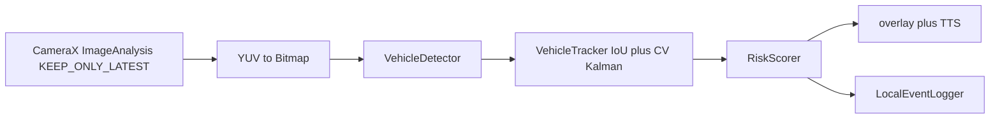

# Smart glasses vehicle-alert MVP

Android/Kotlin on-device pipeline: camera frames → detections → short-horizon tracks → risk score → visual and spoken alerts.

Wearable-safety prototype (crossing / approach warnings). **Not a production ADAS product.** No claimed mAP, FPS, or end-to-end latency — the overlay prints whatever this device just measured.

Useful as a systems interview artifact: CameraX backpressure, frame timing, on-device detector swap, and alert UX constraints.

## What is real vs mock vs not claimed

| Piece | Status |
| --- | --- |
| CameraX preview + `ImageAnalysis` | Real. Back camera, lifecycle-bound. |
| `STRATEGY_KEEP_ONLY_LATEST` | Real. Analyzer holds one in-flight frame; extras are dropped. |
| Overlay + TTS debounce | Real (`AlertManager` cooldowns by alert level). |
| Risk scorer + profiles | Real, covered by JVM tests. |
| Tracker (IoU + CV Kalman) | Real, covered by JVM tests. Not BYTETrack/SORT published numbers. |
| **Default detector** | **`MlKitVehicleDetector`** — bundled ML Kit Object Detection. |
| `MockVehicleDetector` | Debug-only: `BuildConfig.DEBUG && BuildConfig.USE_MOCK_DETECTOR`. Default of that flag is `false`. |
| `TFLiteVehicleDetector` | Stub. Opens an interpreter if you supply weights; `detect()` still returns empty. No `.tflite` in git. |
| Vehicle-class labels | **Not claimed.** ML Kit's coarse classifier is fashion/food/home/place/plant, so it is left off. Every ML Kit box is a *vehicle candidate*. False positives on non-vehicles are expected. |
| GPU / NNAPI / TFLite delegates | **Not enabled.** Adding them without a measured model would be a fake speedup. |
| Production ADAS | **Not this repo.** |

## Architecture



`MainActivity` constructs `MlKitVehicleDetector` unless both `BuildConfig.DEBUG` and `USE_MOCK_DETECTOR` are true. It binds back-camera preview and analysis on a **single-thread executor**. Each kept frame: bitmap → `detect` → IoU match against Kalman-predicted boxes → weighted score from box-area growth, center threat, and confidence persistence → `AlertManager` and a latency/FPS overlay.

If ML Kit fails to initialize, the overlay and log show the error. The pipeline does **not** silently emit fake boxes. Init-failure fallback to the mock is not automatic; turn on `USE_MOCK_DETECTOR` in a debug build if you need a synthetic box.

Risk profiles: `CONSERVATIVE`, `BALANCED`, `SENSITIVE`. Alert levels: idle / advisory / warning / critical.

## Why KEEP_ONLY_LATEST

Glasses and phones cannot queue a backlog of camera frames behind a slow detector. `STRATEGY_KEEP_ONLY_LATEST` drops stale frames so the tracker/scorer see the newest image, not a delayed one. The overlay's `Latency` line is *that frame's* wall time (bitmap convert + detect + track + score), not a lab benchmark. FPS is a rolling window from `PerformanceMonitor`, not a claimed throughput.

ML Kit `detect()` blocks the analyzer thread with `Tasks.await` and a short timeout. While it runs, CameraX drops newer frames — that is the backpressure. Do not move inference onto the main thread.

## Detector choice

Default artifact: `com.google.mlkit:object-detection:17.0.2` (bundled model in the APK). This avoids a Play Services model download at runtime. `STREAM_MODE` + `enableMultipleObjects()`. Classification is off, because the bundled categories are not vehicles.

`play-services-mlkit-object-detection` would download the model; this project does not use it.

Optional later path: drop an EfficientDet-Lite0 `.tflite` into `app/src/main/assets/` and construct `TFLiteVehicleDetector.fromAssets()`. Pre/post-processing is still unimplemented. GPU/NNAPI would belong there *after* a real model and a measured comparison — not before.

To force the mock in a debug APK, set `buildConfigField("boolean", "USE_MOCK_DETECTOR", "true")` in `app/build.gradle.kts` (still ignored for release because of the `BuildConfig.DEBUG` guard).

## Stack

- Kotlin, Android SDK 28–34, Java 17
- CameraX 1.4.2, AppCompat / Material, view binding, coroutines
- ML Kit Object Detection 17.0.2 (bundled)
- TensorFlow Lite 2.16 (optional stub only)
- Android `TextToSpeech`
- JUnit 4 JVM tests (`:app:testDebugUnitTest`)

## Layout

- `app/src/main/java/com/smartglasses/safety/MainActivity.kt` — camera bind, permission, detector selection, UI
- `.../pipeline/MlKitVehicleDetector.kt` — default detector
- `.../pipeline/VehicleTracker.kt` — greedy IoU association + constant-velocity Kalman on (cx, cy, w, h)
- `.../pipeline/RiskScorer.kt` — profiles and thresholds
- `app/src/test/java/` — scorer and tracker tests
- `docs/` — optimization checklist and field-validation notes (goals, not measured results)

## Build

1. Open the repo root in Android Studio (Hedgehog+ / AGP 8.5).
2. Let Gradle sync; install SDK 34 if prompted.
3. If `gradle-wrapper.jar` is missing, Studio generates it on first sync. It is **not** committed (binary through the GitHub API is easy to corrupt). CI uses `gradle/actions/setup-gradle` with `gradle-version: 8.7` instead of `./gradlew`.
4. Deploy to a device or glasses hardware with a back camera.
5. Grant camera permission.

```bash
# After Studio has generated gradle-wrapper.jar, or with a local Gradle 8.7:
./gradlew :app:testDebugUnitTest
./gradlew :app:assembleDebug
```

CI runs **unit tests only**. `assembleDebug` is not part of Actions because this workflow does not install a full SDK image.

## Tracker (short)

- Predict each track with a 2-state constant-velocity Kalman per box parameter.
- Greedy match detections to predicted boxes by IoU (threshold 0.3).
- Unmatched detections get a new ID. Unmatched tracks increment `misses` and expire after `maxMisses` (default 5).
- Returned `TrackedVehicle` still carries the fields the scorer and overlay already use.

This is a small on-device associator, not a published MOT algorithm and not evaluated on MOT17/BDD.

MIT license (see `LICENSE`).
