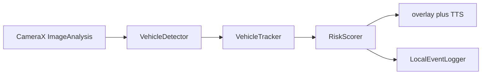

# Smart glasses vehicle-alert MVP

Android/Kotlin on-device pipeline: camera frames → detections → short-horizon tracks → risk score → visual and spoken alerts.

Built as a wearable-safety prototype (crossing / approach warnings). **Not a production ADAS product.** Useful as a systems interview artifact: frame timing, backpressure, and on-device UX constraints.

## Architecture



`MainActivity` binds back-camera preview and `ImageAnalysis.STRATEGY_KEEP_ONLY_LATEST` on a single-thread executor. Keep-only-latest is the backpressure policy: if inference is slower than the camera, **the analyzer drops stale frames and keeps the newest**. That trades completeness for freshness, which is what a crossing warning needs. There is no unbounded queue.

Each kept frame: YUV → bitmap → `detect` → IoU + constant-velocity Kalman track → weighted score from box-area growth, center threat, and confidence persistence → `AlertManager` (level-dependent TTS cooldown) and a latency/FPS overlay that also names the active detector.

Risk profiles: `CONSERVATIVE`, `BALANCED`, `SENSITIVE`. Alert levels: idle / advisory / warning / critical.

## What is real vs mock vs not claimed

| Piece | Status |
| --- | --- |
| CameraX preview + analysis bind | Real |
| `STRATEGY_KEEP_ONLY_LATEST` backpressure | Real |
| Overlay latency/FPS + TTS debounce | Real |
| Risk scorer + profiles | Real (heuristic, not a calibrated TTC) |
| Tracker | Real IoU + diagonal Kalman on `(cx, cy, w, h, vx, vy)`; BYTE-style two-stage association. Not ByteTrack, not a full MOT solver |
| Default detector | **ML Kit Object Detection** (bundled, STREAM_MODE). Real boxes. Coarse labels, **not** COCO vehicles |
| Optional detector | **TFLite EfficientDet-Lite0** when Gradle downloads the official `.tflite`. Real preprocess / Interpreter / postprocess. Filters COCO to bicycle, car, motorcycle, bus, truck |
| `MockVehicleDetector` | Debug-only (`BuildConfig.DEBUG && USE_MOCK_DETECTOR`, default **false**). Synthetic centered car box |
| Load failure | Overlay + log show `DETECTOR FAILED`. **No silent fake boxes** |
| GPU / NNAPI | **Not enabled.** Later work: per-device accuracy, warmup, CPU fallback. No invented FPS from delegates |
| End-to-end latency / mAP | **Not claimed.** Overlay prints whatever the device measured that session |
| Production ADAS | **Not this repo** |

See `models/SOURCE.md` for the EfficientDet URL, SHA-256, and licenses.

## On-device constraints

- **Thermal:** continuous 320×320 (or ML Kit) inference on a glasses SoC will throttle. The analyzer thread is already single; do not add extra workers that fight the camera.
- **Camera FPS vs model FPS:** the camera may deliver 30 fps; keep-only-latest means effective rate is however fast `detect` returns. That is expected.
- **Model size:** EfficientDet-Lite0 with metadata is ~4.4 MB. Download happens at `preBuild`, not at runtime, and is skipped (with a warning) if the network or checksum fails.
- **Frame timing:** `PerformanceMonitor` records per-frame `elapsedRealtime` and a rolling FPS. Treat those numbers as device-specific, not a spec.

## Stack

- Kotlin, Android SDK 28–34, Java 17
- CameraX **1.4.2**, AppCompat / Material, view binding, coroutines
- ML Kit Object Detection 17.0.2 (default)
- TensorFlow Lite 2.16.1 (optional EfficientDet-Lite0 path)
- Android `TextToSpeech`
- JUnit 4 JVM tests for scorer + tracker

## Layout

- `app/src/main/java/com/smartglasses/safety/MainActivity.kt` — camera bind, permission, overlay
- `.../pipeline/DetectorFactory.kt` — ML Kit / TFLite / debug-mock selection
- `.../pipeline/TFLiteVehicleDetector.kt` — Interpreter preprocess / invoke / postprocess
- `.../pipeline/MlKitVehicleDetector.kt` — bundled STREAM_MODE detector
- `.../pipeline/VehicleTracker.kt` — IoU + Kalman
- `.../pipeline/RiskScorer.kt` — profiles and thresholds
- `models/SOURCE.md` — weights URL, SHA-256, licenses
- `docs/` — optimization checklist and field-validation notes

## Build

1. Open the repo root in Android Studio (Hedgehog+ / AGP 8.5).
2. Let Gradle sync. AGP 8.5 wants **Gradle 8.7**. This repo ships `gradlew`, `gradlew.bat`, and `gradle/wrapper/gradle-wrapper.properties`. It does **not** ship `gradle-wrapper.jar` (binary). Studio generates the jar on first sync; CI uses `gradle/actions/setup-gradle` with `gradle-version: 8.7`.
3. First `preBuild` tries to download EfficientDet-Lite0 into `app/build/downloaded-assets/`. If that fails, the app still runs on ML Kit.
4. Deploy to a device or glasses hardware with a back camera. Grant camera permission.

```bash
chmod +x gradlew   # if git did not preserve the execute bit
./gradlew :app:testDebugUnitTest
# assembleDebug needs a local Android SDK; it is not run in CI
```

Flip the mock (debug builds only) by setting `USE_MOCK_DETECTOR` to `true` in `app/build.gradle.kts` `defaultConfig`. Leave it `false` for anything you would demo.

## Tests and CI

`.github/workflows/ci.yml` runs `:app:testDebugUnitTest` on Ubuntu with Temurin 17, Android SDK platform 34, and Gradle 8.7. It does **not** run `assembleDebug` (no full APK image in that job). A green CI means the JVM scorer/tracker tests passed, not that an APK was produced.

MIT license (see `LICENSE`).
