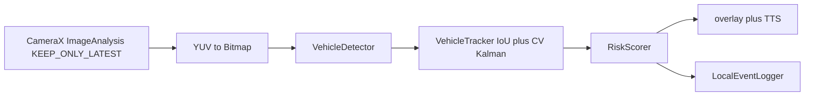

# Smart glasses vehicle-alert MVP

Android/Kotlin on-device pipeline: camera frames → detections → short-horizon tracks → risk score → overlay + spoken alerts.

Wearable-safety prototype (crossing / approach warnings). **Not production ADAS.** Useful as a systems interview artifact: camera backpressure, on-device detection, and alert UX under a thermal/power budget.

No claimed mAP, FPS, or end-to-end latency — the overlay prints whatever this device just measured.

## What is real vs not

**Real**

- CameraX preview + `ImageAnalysis` with `STRATEGY_KEEP_ONLY_LATEST` (drop stale frames instead of queuing them).
- Default detector: bundled ML Kit Object Detection (`MlKitVehicleDetector`, `STREAM_MODE`, multiple objects). The model is in the APK (`com.google.mlkit:object-detection:17.0.2`); no Play download at runtime.
- Tracker: greedy IoU association plus independent constant-velocity Kalman filters on `(cx, cy, w, h)`. Tracks expire after missed frames. Same `TrackedVehicle` fields the scorer already uses (`areaGrowth`, `centerDriftToMiddle`, `confidencePersistence`). Write-up: [`DESIGN.md`](DESIGN.md).
- Risk scorer (`CONSERVATIVE` / `BALANCED` / `SENSITIVE`), TTS debounce, latency/FPS overlay, local event log.
- JUnit 4 JVM tests for the scorer and tracker (`:app:testDebugUnitTest`).

**Mock / optional**

- `MockVehicleDetector` (centered fake "car" box) only if `BuildConfig.DEBUG && USE_MOCK_DETECTOR`. That flag defaults to `false`. Release always constructs `MlKitVehicleDetector`.
- `TFLiteVehicleDetector` is an optional LiteRT adapter for a future EfficientDet-Lite asset. **No trained weights are in this repo.** `detect()` returns empty until a signature is wired — it does not silently mock. Init tries GPU (`CompatibilityList`), then NNAPI, then CPU; whichever binds is logged. A failed delegate is skipped. That is not a claimed speedup: there is still no model.

**Honest limits**

- Bundled ML Kit finds generic objects. Its optional coarse classifier is fashion/food/home/place/plant, **not vehicle classes**, so classification is left off. Every box is a vehicle *candidate*. Expect false positives on people, bags, signs.
- Kalman process/measure noise are untuned defaults, not a MOT benchmark and not ByteTrack.
- Overlay latency/FPS are whatever that phone reports at runtime. This README does not claim a measured mAP or millisecond budget.

## Architecture



`MainActivity` constructs `MlKitVehicleDetector` unless both `BuildConfig.DEBUG` and `USE_MOCK_DETECTOR` are true. It binds the back camera and a **single-thread** analyzer. Each kept frame: YUV → bitmap → `detect` → `track` → `score` → overlay + `AlertManager`. `ImageProxy` is closed on every path so the camera does not stall. If ML Kit fails to initialize, the overlay and log show the error; the pipeline does not emit fake boxes.

Risk levels: idle / advisory / warning / critical.

## Why `KEEP_ONLY_LATEST`

Glasses and phones cannot afford a backlog of frames. `STRATEGY_KEEP_ONLY_LATEST` is the backpressure valve: if inference is slower than the camera, the analyzer drops the old frame and keeps the newest view of the world. Processing a queued, stale frame would alert on a car that has already moved. Frame time is measured on the analyzer thread (bitmap convert + detect + track + score); TTS is coalesced so speech does not block the next frame. FPS is a rolling window from `PerformanceMonitor`, not a claimed throughput.

ML Kit `detect()` blocks that analyzer thread with `Tasks.await` and a short timeout. While it runs, CameraX drops newer frames — that is the backpressure. Do not move inference onto the main thread.

GPU/NNAPI on the optional LiteRT path is the same idea: only enable a delegate if it actually binds, then fall back. Shipping a fake 2× is worse than CPU.

## Stack

- Kotlin, minSdk 28, compileSdk 34, Java 17
- CameraX 1.4.2, AppCompat / Material, view binding, coroutines
- ML Kit Object Detection 17.0.2 (bundled)
- LiteRT / TensorFlow Lite (optional adapter only; GPU → NNAPI → CPU bind order)
- Gradle version catalog (`gradle/libs.versions.toml`)
- JUnit 4 JVM tests

## Layout

- `app/src/main/java/com/smartglasses/safety/MainActivity.kt` — camera bind, permission, detector choice
- `.../pipeline/MlKitVehicleDetector.kt` — default on-device detector
- `.../pipeline/VehicleTracker.kt` — IoU + Kalman
- `.../pipeline/RiskScorer.kt` — weighted approach score
- `.../pipeline/MockVehicleDetector` in `VehicleDetector.kt` — debug-only
- `.../pipeline/TFLiteVehicleDetector.kt` — optional LiteRT path, no weights
- `app/src/test/java/` — scorer and tracker tests
- `DESIGN.md` — tracker design (SORT-style, honest about what is not implemented)
- `docs/` — field-validation notes (goals, not measured results)

## Build

1. Open the repo root in Android Studio (Hedgehog+ / AGP 8.5).
2. Let Gradle sync; install SDK 34 if prompted.
3. Wrapper **scripts** (`gradlew`, `gradlew.bat`) and `gradle/wrapper/gradle-wrapper.properties` (Gradle 8.7) are in git. `gradle-wrapper.jar` is **not** committed (easy to corrupt through the GitHub API). Android Studio generates the jar on first sync. CI uses `gradle/actions/setup-gradle` with `gradle-version: 8.7` instead of `./gradlew`.
4. Deploy to a device with a back camera (or glasses hardware).
5. Grant camera permission.

```bash
# After Studio has generated gradle-wrapper.jar, or with a local Gradle 8.7:
./gradlew :app:testDebugUnitTest
./gradlew :app:assembleDebug
```

CI runs **unit tests only**. `assembleDebug` is not part of Actions because this workflow does not install a full SDK image. `USE_MOCK_DETECTOR` stays `false` unless you flip the `buildConfigField` in `app/build.gradle.kts` (still ignored for release because of the `BuildConfig.DEBUG` guard).

## On-device constraints

Wearable cameras are low-power: target a modest analysis resolution, close every `ImageProxy`, and do not keep a frame queue. The bundled ML Kit model avoids a runtime download, at the cost of **not** being a COCO vehicle detector. A real vehicle-class model (EfficientDet-Lite0 or similar) belongs on the LiteRT path once weights are vendored or downloaded with a documented checksum — they are not here yet.

MIT license (see `LICENSE`). Copyright (c) 2026 Taiyu Zhu.
