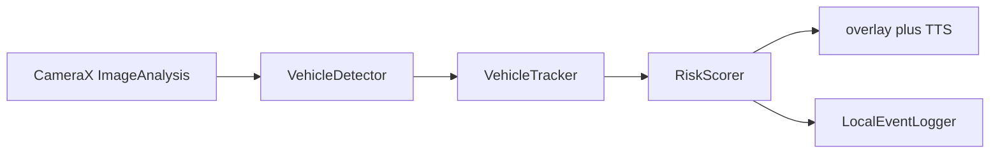

# Smart glasses vehicle-alert MVP

Android/Kotlin on-device pipeline: camera frames → detections → short-horizon tracks → risk score → visual and spoken alerts.

Built as a wearable-safety prototype (crossing / approach warnings). The CameraX path, tracker, scorer, TTS debounce, and latency overlay are real. The live detector is still a mock; TFLite is wired as an empty adapter.

Not a production ADAS product. Useful as a systems interview artifact: frame timing, backpressure, and on-device UX constraints.

## Architecture



`MainActivity` binds back camera preview and `STRATEGY_KEEP_ONLY_LATEST` analysis on a single-thread executor. Each frame: bitmap → `detect` → nearest-center track (8-frame history) → weighted score from box-area growth, center threat, and confidence persistence → `AlertManager` (level-dependent TTS cooldown) and a latency/FPS overlay.

Risk profiles: `CONSERVATIVE`, `BALANCED`, `SENSITIVE`. Alert levels: idle / advisory / warning / critical.

## Stack

- Kotlin, Android SDK 28–34, Java 17
- CameraX 1.3, AppCompat / Material, view binding
- TensorFlow Lite 2.16 (dependency + `TFLiteVehicleDetector` stub)
- Android `TextToSpeech`

## Layout

- `app/src/main/java/com/smartglasses/safety/MainActivity.kt` — camera bind, permission, UI
- `.../pipeline/` — detector interface, mock detector, TFLite stub, tracker, scorer, alerts, perf, logger
- `docs/` — optimization checklist and field-validation notes

## Build

1. Open the repo root in Android Studio (Hedgehog+).
2. Let Gradle sync; install SDK 34 if prompted.
3. Deploy to a device or glasses hardware with a back camera.
4. Grant camera permission.

```bash
./gradlew :app:assembleDebug   # if the Gradle wrapper is present locally
```

This snapshot does not include `gradlew`. Android Studio will generate the wrapper on first sync.

## Status

`MainActivity` constructs `MockVehicleDetector`, which always returns a centered "car" box so the rest of the pipeline can run without a model. `TFLiteVehicleDetector` opens an interpreter and returns an empty list until a real signature and preprocessing are filled in. No trained weights are in the repo. Tracking is nearest-center, not a full MOT solver.

MIT license (see `LICENSE`).
