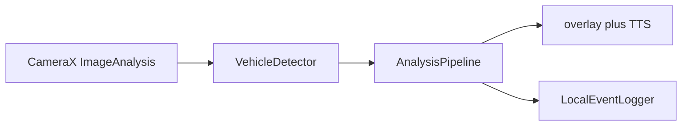

# Smart glasses vehicle-alert MVP

[](https://github.com/taiyuz/smart-glasses-safety/actions/workflows/ci.yml)

On-device Android/Kotlin pipeline: **CameraX frames → ML Kit object detection → IoU + Kalman tracks → risk score → overlay + spoken TTS**. Inference stays on the phone — no cloud API, no video upload, no Play-services model download for the default detector.

Wearable-safety prototype (crossing / approach warnings). **Not production ADAS.** Useful as a systems interview artifact: camera backpressure, on-device detection, and alert UX under a thermal/power budget.

## What is real vs not

**Runs on-device (default debug and release)**

- CameraX preview + `ImageAnalysis` with `STRATEGY_KEEP_ONLY_LATEST` (drop stale frames instead of queuing them).
- Default detector: bundled ML Kit Object Detection (`MlKitVehicleDetector`, `STREAM_MODE`, multiple objects). The model is in the APK (`com.google.mlkit:object-detection:17.0.2`); no Play download at runtime.
- Tracker: greedy IoU association plus independent constant-velocity Kalman filters on `(cx, cy, w, h)`. Tracks expire after missed frames. Same `TrackedVehicle` fields the scorer already uses (`areaGrowth`, `centerDriftToMiddle`, `confidencePersistence`). Write-up: [DESIGN.md](DESIGN.md) (Bewley et al., ICIP 2016; greedy IoU, not Hungarian, not ByteTrack).
- `AnalysisPipeline` owns tracker + scorer for one camera session and **resets** them on `onStop`, camera rebind, resolution change, or a >2s gap between processed frames. That drops Kalman velocity and held risk-hysteresis state from a previous scene; it is not ByteTrack.
- Risk scorer (`CONSERVATIVE` / `BALANCED` / `SENSITIVE`) with enter/exit hysteresis so alert levels do not flicker around a threshold, TTS debounce, latency/FPS overlay, local event log.
- Optional LiteRT path (`TFLiteVehicleDetector`): tries GPU (`CompatibilityList` + `GpuDelegate`), then NNAPI, then CPU, and logs which bound. **No trained weights are in this repo**, so this path still returns no boxes. It does not silently mock.

**Mock / debug-only (not the default)**

- `MockVehicleDetector` (centered fake "car" box) only if `BuildConfig.DEBUG && USE_MOCK_DETECTOR`. That flag defaults to `false`. Release always constructs `MlKitVehicleDetector`.

**Honest limits**

- Bundled ML Kit finds generic objects. Its optional coarse classifier is fashion/food/home/place/plant, **not vehicle classes**, so classification is left off. Every box is a vehicle *candidate*. Expect false positives on people, bags, signs.
- Kalman process/measure noise are untuned defaults, not a MOT benchmark and not ByteTrack.
- Overlay latency/FPS are whatever that phone reports at runtime. This README does not claim a measured mAP or millisecond budget.
- LiteRT GPU/NNAPI is a bind-or-skip fallback, not a claimed speedup.
- `gradle-wrapper.jar` is not in git. CI does not run `./gradlew` and does not `assembleDebug`.

## Architecture



`MainActivity` binds the back camera and a single-thread analyzer. Each frame: YUV → bitmap → `detect` → `AnalysisPipeline.process` (track + score) → overlay + `AlertManager`. `ImageProxy` is closed on every path so the camera does not stall. `onStop` and a new camera bind call `pipeline.reset()`.

Risk levels: idle / advisory / warning / critical.

## Why `KEEP_ONLY_LATEST`

Glasses and phones cannot afford a backlog of frames. `STRATEGY_KEEP_ONLY_LATEST` is the backpressure valve: if inference is slower than the camera, the analyzer drops the old frame and keeps the newest view of the world. Processing a queued, stale frame would alert on a car that has already moved. Frame time is measured on the analyzer thread; TTS is coalesced so speech does not block the next frame.

GPU/NNAPI on the LiteRT path is the same idea: only enable a delegate if it actually binds, then fall back. A comment that says "GPU later" with a fake 2× is worse than CPU.

## Stack

- Kotlin, minSdk 28, compileSdk 34, Java 17
- CameraX 1.4.2, AppCompat / Material, view binding, coroutines
- ML Kit Object Detection 17.0.2 (bundled)
- LiteRT 1.4.2 + GPU artifacts (optional adapter; Interpreter API + delegates)
- Gradle version catalog (`gradle/libs.versions.toml`; ML Kit alias is `mlkit-objectdetection` so the Kotlin DSL does not hit the `object` keyword)

## Layout

- `app/src/main/java/com/smartglasses/safety/MainActivity.kt` — camera bind, permission, detector choice, pipeline reset on stop/rebind
- `.../pipeline/AnalysisPipeline.kt` — session-scoped tracker + scorer, pause/gap reset
- `.../pipeline/MlKitVehicleDetector.kt` — default on-device detector
- `.../pipeline/VehicleTracker.kt` — IoU + Kalman
- `.../pipeline/RiskScorer.kt` — weighted approach score + enter/exit hysteresis
- `.../pipeline/MockVehicleDetector` in `VehicleDetector.kt` — debug-only
- `.../pipeline/TFLiteVehicleDetector.kt` — optional LiteRT path, GPU → NNAPI → CPU
- [DESIGN.md](DESIGN.md) — tracker algorithm + the one paper that matches it
- `docs/` — field-validation notes
- `.github/workflows/ci.yml` — JVM unit tests (`:app:testDebugUnitTest`)

## JVM unit tests

CI on `main` runs the tracker, scorer, and pipeline tests (no emulator, no `assembleDebug`). From the repo root, with JDK 17 and Android SDK 34 (Android Studio sync is enough):

```bash
./gradlew :app:testDebugUnitTest
```

`gradle/wrapper/gradle-wrapper.properties` pins Gradle 8.7. This snapshot does **not** include `gradle-wrapper.jar` (binary); Android Studio generates it on first sync. Do not commit a placeholder jar. GitHub Actions uses `gradle/actions/setup-gradle` at that same version and invokes `gradle :app:testDebugUnitTest` — it does **not** run `./gradlew` or `assembleDebug` (assemble needs a full SDK image).

If the wrapper jar is already on disk (after an Android Studio sync):

```bash
./gradlew :app:assembleDebug
```

`USE_MOCK_DETECTOR` stays `false` unless you flip the `buildConfigField` in `app/build.gradle.kts`.

## Build (device)

1. Open the repo root in Android Studio (Hedgehog+).
2. Let Gradle sync; it creates `gradle/wrapper/gradle-wrapper.jar` locally if missing.
3. Deploy to a device with a back camera (or glasses hardware).
4. Grant camera permission.

## On-device constraints

Wearable cameras are low-power: target a modest analysis resolution, close every `ImageProxy`, and do not keep a frame queue. The bundled ML Kit model avoids a runtime download, at the cost of **not** being a COCO vehicle detector. A real vehicle-class model (EfficientDet-Lite0 or similar) belongs on the LiteRT path once weights are vendored or downloaded with a documented checksum — they are not here yet.

MIT license (see `LICENSE`). Copyright (c) 2026 Taiyu Zhu.
