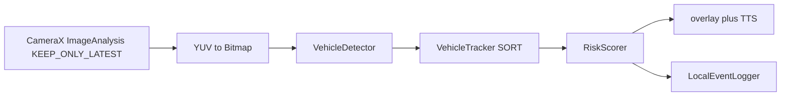

# Smart glasses vehicle-alert MVP

Android/Kotlin on-device pipeline: camera frames → detections → short-horizon tracks → risk score → visual and spoken alerts.

Wearable-safety prototype (crossing / approach warnings). **Not a production ADAS product.** No claimed mAP, FPS, or end-to-end latency — the overlay prints whatever this device just measured.

Useful as a systems interview artifact: CameraX backpressure, frame timestamps, on-device detector swap, and alert UX constraints.

## What is real vs mock vs not claimed

| Piece | Status |
| --- | --- |
| CameraX preview + `ImageAnalysis` | Real. Back camera, lifecycle-bound, `setTargetResolution(640, 480)`. |
| `STRATEGY_KEEP_ONLY_LATEST` | Real. Analyzer holds one in-flight frame; extras are dropped. |
| Frame timestamps | Real. `imageProxy.imageInfo.timestamp` is logged and shown on the overlay. |
| Overlay + TTS debounce | Real (`AlertManager` cooldowns). TTS is posted off the analyzer thread. |
| Risk scorer + profiles | Real, covered by JVM tests. |
| Tracker | Real SORT (IoU + CV Kalman). See [DESIGN.md](DESIGN.md). |
| **Default detector** | **`MlKitVehicleDetector`** — bundled ML Kit Object Detection. |
| `MockVehicleDetector` | Debug-only: `BuildConfig.DEBUG && BuildConfig.USE_MOCK_DETECTOR` (flag default `false`). |
| `LiteRtVehicleDetector` | Optional. `USE_LITERT_DETECTOR`. GPU → NNAPI → CPU `InterpreterApi` delegates. Fails visibly without a `.tflite` in `assets/`; never invents boxes. |
| Vehicle-class labels | **Not claimed.** ML Kit coarse classes are not vehicles; classification is off. Boxes are object *candidates*. |
| GPU / NNAPI speedups | **Implemented as fallback wiring, not measured.** No FPS/latency claims from enabling a delegate. |
| Production ADAS | **Not this repo.** |

## Architecture



`MainActivity` constructs `MlKitVehicleDetector` unless `BuildConfig.DEBUG && USE_MOCK_DETECTOR`, or `USE_LITERT_DETECTOR`. It binds back-camera preview and analysis on a **single-thread executor**. Each kept frame is closed in `try/finally`: bitmap → `detect` → SORT track → score → overlay. `ImageProxy.imageInfo.timestamp` is recorded per frame.

Risk profiles: `CONSERVATIVE`, `BALANCED`, `SENSITIVE`. Alert levels: idle / advisory / warning / critical.

## Why KEEP_ONLY_LATEST

Glasses and phones cannot queue a backlog of camera frames behind a slow detector. `STRATEGY_KEEP_ONLY_LATEST` drops stale frames so the tracker/scorer see the newest image. Overlay `Latency` is *that frame's* wall time (convert + detect + track + score), not a lab benchmark. FPS is a rolling window from `PerformanceMonitor`.

ML Kit `detect()` blocks the analyzer thread with `Tasks.await` and a short timeout. While it runs, CameraX drops newer frames — that is the backpressure. TTS is announced on the main thread so speech does not stretch analyzer occupancy.

## Detector choice

Default artifact: `com.google.mlkit:object-detection:17.0.2` (bundled in the APK). `STREAM_MODE` + `enableMultipleObjects()`. Classification is off.

Optional LiteRT path (`com.google.ai.edge.litert:litert` / `litert-gpu` / `litert-gpu-api` **1.4.2**, Interpreter line): constructs `GpuDelegate`, then `NnApiDelegate`, then CPU `InterpreterApi`. Whichever binds is logged. LiteRT 2.x Interpreter is CPU-only, so 1.4.2 is the current Interpreter+delegate coordinate. Without a `.tflite` in `assets/`, `initialize` throws. No binary model is in git.

To force the mock in a debug APK, set `USE_MOCK_DETECTOR` to `true` (still ignored for release because of the `BuildConfig.DEBUG` guard).

## On-device constraints

- Wearable thermal/power budget: 640×480 analysis, keep-latest backpressure, one analyzer thread.
- No cloud round-trip in the detect/track/score path.
- TTS is debounced by alert level and posted off the analyzer.

## Stack

- Kotlin, Android SDK 28–34, Java 17, version catalog, `buildConfig = true`
- CameraX 1.4.2, AppCompat / Material, view binding, coroutines
- ML Kit Object Detection 17.0.2 (bundled)
- LiteRT 1.4.2 InterpreterApi + GPU/NNAPI optional delegates
- Android `TextToSpeech`
- JUnit 4 JVM tests (`:app:testDebugUnitTest`)

## Layout

- `app/src/main/java/com/smartglasses/safety/MainActivity.kt` — camera bind, detector selection, UI
- `.../pipeline/MlKitVehicleDetector.kt` — default detector
- `.../pipeline/LiteRtVehicleDetector.kt` — optional InterpreterApi path
- `.../pipeline/VehicleTracker.kt` — SORT IoU + Kalman
- `DESIGN.md` — tracker algorithm + Bewley et al. citation
- `app/src/test/java/` — scorer and tracker tests
- `docs/` — field-validation notes (goals, not measured results)

## Build

1. Open the repo root in Android Studio (Hedgehog+ / AGP 8.5).
2. Let Gradle sync; install SDK 34 if prompted.
3. `gradle-wrapper.jar` is **not** committed (GitHub MCP would corrupt the binary). CI uses `gradle/actions/setup-gradle` with `gradle-version: 8.7`. Studio generates the jar on first sync.
4. Deploy to a device or glasses hardware with a back camera.
5. Grant camera permission.

```bash
# After Studio has generated gradle-wrapper.jar, or with a local Gradle 8.7:
./gradlew :app:testDebugUnitTest
./gradlew :app:assembleDebug
```

CI runs **unit tests only**. `assembleDebug` is not part of Actions because this workflow does not install a full SDK image.

MIT license (see `LICENSE`).
